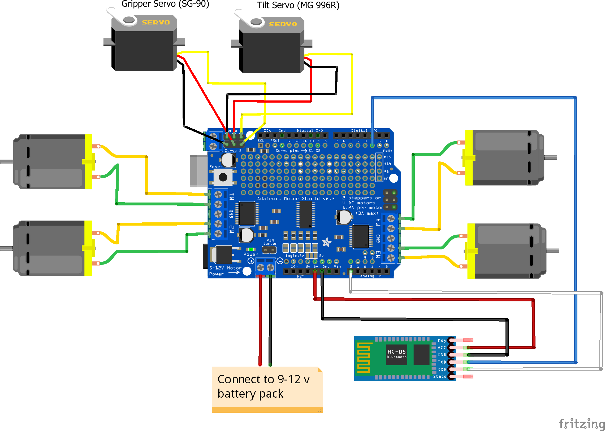

# Car components
- Arduino Uno
- Car body and 4 DC motors
- Adafruit Arduino Motor Shield 4 Channel L293D H-Bridge
- HC-05 bluetooth modules
- 12 V source power 
- 2 Servos (SG-90 & MG-996R)
- 3D printing for gripper 
# Connection 

